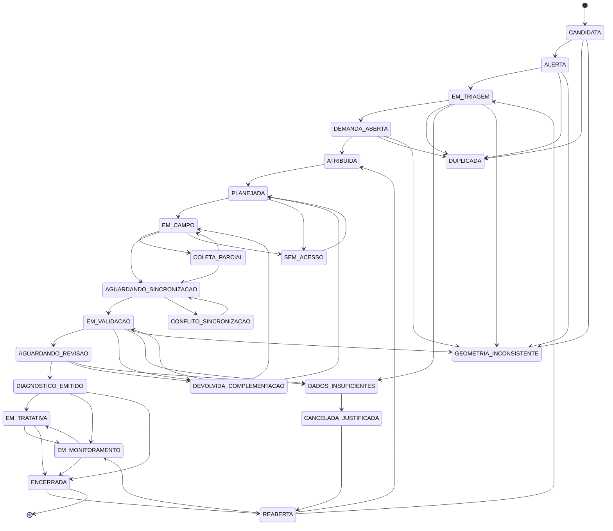

# Fluxo de estados da Demanda

> Arquivo GERADO por `scripts/gerar_contratos.py` a partir de `src/gaema_sd/estados/maquina.py`.
> Não editar à mão: o teste `tests/test_contratos.py` falha se divergir do código.

Nível: TESTADO LOCALMENTE (Fase 2). Proveniência: INSTITUCIONAL (lista de estados) e AUTORAL
(papéis, pré-condições e transições).

## Regras gerais

- Toda transição aceita gera evento de auditoria com ator, papéis, origem, destino, motivo e data.
- Toda recusa (papel indevido, transição inexistente, pré-condição falha, conflito) também é auditada.
- Quando a coluna Motivo indica "sim", o motivo tem no mínimo 10 caracteres.
- Estados excepcionais com "retorno" só voltam ao estado anterior à exceção.
- Cancelamento justificado é possível a partir de qualquer estado, exceto ENCERRADA, DUPLICADA e a própria CANCELADA_JUSTIFICADA; sai por REABERTA (só MEMBRO_MP).
- ADMINISTRADOR e AUDITOR nunca movem o fluxo (separação de funções).
- Reversão: indica a transição inversa existente, quando houver. Nada é apagado; reverter é nova
  transição auditada.

## Diagrama (sem cancelamentos e sem retornos de exceção)

## Estados

| Estado | Tipo | Significado |
|---|---|---|
| CANDIDATA | normal | Área indicada por sinal remoto; nenhuma conclusão |
| ALERTA | normal | Sinal registrado como alerta para triagem |
| EM_TRIAGEM | normal | Análise humana do alerta |
| DEMANDA_ABERTA | normal | Averiguação formalmente aberta |
| ATRIBUIDA | normal | Equipe técnica designada |
| PLANEJADA | normal | Vistoria planejada, protocolo definido |
| EM_CAMPO | normal | Vistoria em andamento (pode estar offline) |
| COLETA_PARCIAL | normal | Coleta interrompida; pode ser retomada |
| AGUARDANDO_SINCRONIZACAO | normal | Dados coletados aguardando envio |
| EM_VALIDACAO | normal | Conferência dos dados recebidos |
| AGUARDANDO_REVISAO | normal | Diagnóstico computado aguardando revisão técnica |
| DIAGNOSTICO_EMITIDO | normal | Diagnóstico revisado e emitido |
| EM_TRATATIVA | normal | Tratativa institucional em curso |
| EM_MONITORAMENTO | normal | Acompanhamento de marcos |
| ENCERRADA | normal | Encerrada com motivo |
| REABERTA | normal | Reaberta com motivo |
| DUPLICADA | excepcional | Mesma área/objeto de outra demanda |
| DADOS_INSUFICIENTES | excepcional | Faltam dados para prosseguir |
| SEM_ACESSO | excepcional | Equipe não conseguiu acessar a área |
| GEOMETRIA_INCONSISTENTE | excepcional | Geometria com erro a corrigir |
| CONFLITO_SINCRONIZACAO | excepcional | Envio com versões divergentes; decisão humana |
| CANCELADA_JUSTIFICADA | excepcional | Cancelada com justificativa |
| DEVOLVIDA_COMPLEMENTACAO | excepcional | Devolvida para complementar coleta ou análise |

## Pré-condições

| Código | Significado |
|---|---|
| `geometria_valida` | Geometria da área sem erro de validação |
| `fonte_registrada` | Ao menos uma fonte de dado registrada |
| `area_interesse_definida` | Área de interesse definida |
| `equipe_definida` | Equipe atribuída |
| `campanha_planejada` | Campanha de vistoria com data e objetivo |
| `protocolo_definido` | Versão de protocolo vinculada à campanha |
| `missao_baixada` | Missão e mapa baixados para uso offline |
| `nota_acesso_registrada` | Motivo da falta de acesso descrito na campanha |
| `ha_pontos_coletados` | Ao menos um ponto amostral coletado |
| `sem_pendencia_sincronizacao` | Nenhum registro pendente de sincronização |
| `sem_conflito_aberto` | Nenhum conflito de sincronização aberto |
| `diagnostico_computado` | Diagnóstico computado com protocolo versionado |
| `sem_erro_validacao` | Dados de campo sem erro de validação |
| `revisao_aprovada` | Revisão técnica aprovada (com ou sem ressalvas) |
| `revisor_independente` | Revisor não participou da coleta (segregação de funções, AUTORAL) |
| `relatorio_emitido` | Relatório emitido |
| `providencia_registrada` | Providência institucional registrada por membro do MP |
| `ha_marcos` | Plano com ao menos um marco de monitoramento |
| `marcos_resolvidos` | Nenhum marco pendente de verificação |
| `ja_foi_aberta` | Demanda já passou por DEMANDA_ABERTA antes |
| `ja_teve_diagnostico_emitido` | Demanda já passou por DIAGNOSTICO_EMITIDO antes |
| `autoatribuicao_permitida` | Técnico só atribui a si se `autoatribuicao_tecnico` estiver ligado e ele for da equipe definida (coordenador sempre pode) |
| `duplicada_de_informada` | Demanda original informada |
| `destino_e_estado_anterior` | Destino igual ao estado anterior à exceção |

## Transições

| # | Origem | Destino | Quem pode | Pré-condições | Motivo | Reversão | Descrição |
|---|---|---|---|---|---|---|---|
| 1 | CANDIDATA | ALERTA | ANALISTA_TRIAGEM, SISTEMA | `geometria_valida`, `fonte_registrada` | não | não | Sinal remoto vira alerta |
| 2 | CANDIDATA | DUPLICADA | ANALISTA_TRIAGEM, COORDENADOR | `duplicada_de_informada` | sim | DUPLICADA → CANDIDATA | Marcada como DUPLICADA |
| 3 | CANDIDATA | GEOMETRIA_INCONSISTENTE | ANALISTA_TRIAGEM, COORDENADOR, SISTEMA | — | sim | GEOMETRIA_INCONSISTENTE → CANDIDATA | Marcada como GEOMETRIA_INCONSISTENTE |
| 4 | CANDIDATA | CANCELADA_JUSTIFICADA | COORDENADOR, MEMBRO_MP | — | sim | não | Cancelamento justificado |
| 5 | ALERTA | EM_TRIAGEM | ANALISTA_TRIAGEM, COORDENADOR | — | não | não | Início da triagem humana |
| 6 | ALERTA | DUPLICADA | ANALISTA_TRIAGEM, COORDENADOR | `duplicada_de_informada` | sim | DUPLICADA → ALERTA | Marcada como DUPLICADA |
| 7 | ALERTA | GEOMETRIA_INCONSISTENTE | ANALISTA_TRIAGEM, COORDENADOR, SISTEMA | — | sim | GEOMETRIA_INCONSISTENTE → ALERTA | Marcada como GEOMETRIA_INCONSISTENTE |
| 8 | ALERTA | CANCELADA_JUSTIFICADA | COORDENADOR, MEMBRO_MP | — | sim | não | Cancelamento justificado |
| 9 | EM_TRIAGEM | DEMANDA_ABERTA | COORDENADOR, MEMBRO_MP | `area_interesse_definida` | sim | não | Abertura formal da demanda de averiguação |
| 10 | EM_TRIAGEM | DUPLICADA | ANALISTA_TRIAGEM, COORDENADOR | `duplicada_de_informada` | sim | DUPLICADA → EM_TRIAGEM | Marcada como DUPLICADA |
| 11 | EM_TRIAGEM | DADOS_INSUFICIENTES | ANALISTA_TRIAGEM, COORDENADOR, REVISOR_TECNICO | — | sim | DADOS_INSUFICIENTES → EM_TRIAGEM | Marcada como DADOS_INSUFICIENTES |
| 12 | EM_TRIAGEM | GEOMETRIA_INCONSISTENTE | ANALISTA_TRIAGEM, COORDENADOR, SISTEMA | — | sim | GEOMETRIA_INCONSISTENTE → EM_TRIAGEM | Marcada como GEOMETRIA_INCONSISTENTE |
| 13 | EM_TRIAGEM | CANCELADA_JUSTIFICADA | COORDENADOR, MEMBRO_MP | — | sim | não | Cancelamento justificado |
| 14 | DEMANDA_ABERTA | ATRIBUIDA | COORDENADOR, TECNICO_CAMPO | `equipe_definida`, `autoatribuicao_permitida` | não | não | Equipe atribuída |
| 15 | DEMANDA_ABERTA | DUPLICADA | ANALISTA_TRIAGEM, COORDENADOR | `duplicada_de_informada` | sim | DUPLICADA → DEMANDA_ABERTA | Marcada como DUPLICADA |
| 16 | DEMANDA_ABERTA | GEOMETRIA_INCONSISTENTE | ANALISTA_TRIAGEM, COORDENADOR, SISTEMA | — | sim | GEOMETRIA_INCONSISTENTE → DEMANDA_ABERTA | Marcada como GEOMETRIA_INCONSISTENTE |
| 17 | DEMANDA_ABERTA | CANCELADA_JUSTIFICADA | COORDENADOR, MEMBRO_MP | — | sim | não | Cancelamento justificado |
| 18 | ATRIBUIDA | PLANEJADA | COORDENADOR, TECNICO_CAMPO | `campanha_planejada`, `protocolo_definido` | não | não | Vistoria planejada |
| 19 | ATRIBUIDA | CANCELADA_JUSTIFICADA | COORDENADOR, MEMBRO_MP | — | sim | não | Cancelamento justificado |
| 20 | PLANEJADA | EM_CAMPO | TECNICO_CAMPO | `missao_baixada` | não | não | Início da vistoria |
| 21 | PLANEJADA | SEM_ACESSO | TECNICO_CAMPO | `nota_acesso_registrada` | sim | SEM_ACESSO → PLANEJADA | Sem acesso à área |
| 22 | PLANEJADA | CANCELADA_JUSTIFICADA | COORDENADOR, MEMBRO_MP | — | sim | não | Cancelamento justificado |
| 23 | EM_CAMPO | COLETA_PARCIAL | TECNICO_CAMPO | — | sim | COLETA_PARCIAL → EM_CAMPO | Interrupção da coleta |
| 24 | EM_CAMPO | AGUARDANDO_SINCRONIZACAO | SISTEMA, TECNICO_CAMPO | `ha_pontos_coletados` | não | não | Coleta concluída, aguardando envio |
| 25 | EM_CAMPO | SEM_ACESSO | TECNICO_CAMPO | `nota_acesso_registrada` | sim | não | Acesso interrompido |
| 26 | EM_CAMPO | CANCELADA_JUSTIFICADA | COORDENADOR, MEMBRO_MP | — | sim | não | Cancelamento justificado |
| 27 | COLETA_PARCIAL | EM_CAMPO | TECNICO_CAMPO | — | não | EM_CAMPO → COLETA_PARCIAL | Retomada da coleta |
| 28 | COLETA_PARCIAL | AGUARDANDO_SINCRONIZACAO | SISTEMA, TECNICO_CAMPO | `ha_pontos_coletados` | sim | não | Envio de coleta parcial |
| 29 | COLETA_PARCIAL | CANCELADA_JUSTIFICADA | COORDENADOR, MEMBRO_MP | — | sim | não | Cancelamento justificado |
| 30 | AGUARDANDO_SINCRONIZACAO | EM_VALIDACAO | COORDENADOR, SISTEMA | `sem_pendencia_sincronizacao`, `sem_conflito_aberto` | não | não | Dados recebidos |
| 31 | AGUARDANDO_SINCRONIZACAO | CONFLITO_SINCRONIZACAO | COORDENADOR, SISTEMA | — | sim | CONFLITO_SINCRONIZACAO → AGUARDANDO_SINCRONIZACAO | Conflito detectado no envio |
| 32 | AGUARDANDO_SINCRONIZACAO | CANCELADA_JUSTIFICADA | COORDENADOR, MEMBRO_MP | — | sim | não | Cancelamento justificado |
| 33 | EM_VALIDACAO | AGUARDANDO_REVISAO | COORDENADOR, SISTEMA | `diagnostico_computado`, `sem_erro_validacao` | não | não | Diagnóstico pronto para revisão |
| 34 | EM_VALIDACAO | DADOS_INSUFICIENTES | ANALISTA_TRIAGEM, COORDENADOR, REVISOR_TECNICO | — | sim | DADOS_INSUFICIENTES → EM_VALIDACAO | Marcada como DADOS_INSUFICIENTES |
| 35 | EM_VALIDACAO | GEOMETRIA_INCONSISTENTE | ANALISTA_TRIAGEM, COORDENADOR, SISTEMA | — | sim | GEOMETRIA_INCONSISTENTE → EM_VALIDACAO | Marcada como GEOMETRIA_INCONSISTENTE |
| 36 | EM_VALIDACAO | CANCELADA_JUSTIFICADA | COORDENADOR, MEMBRO_MP | — | sim | não | Cancelamento justificado |
| 37 | EM_VALIDACAO | DEVOLVIDA_COMPLEMENTACAO | COORDENADOR, REVISOR_TECNICO | — | sim | DEVOLVIDA_COMPLEMENTACAO → EM_VALIDACAO | Devolução para complementar |
| 38 | AGUARDANDO_REVISAO | DIAGNOSTICO_EMITIDO | REVISOR_TECNICO | `revisao_aprovada`, `revisor_independente` | não | não | Revisão técnica concluída |
| 39 | AGUARDANDO_REVISAO | DADOS_INSUFICIENTES | ANALISTA_TRIAGEM, COORDENADOR, REVISOR_TECNICO | — | sim | DADOS_INSUFICIENTES → AGUARDANDO_REVISAO | Marcada como DADOS_INSUFICIENTES |
| 40 | AGUARDANDO_REVISAO | CANCELADA_JUSTIFICADA | COORDENADOR, MEMBRO_MP | — | sim | não | Cancelamento justificado |
| 41 | AGUARDANDO_REVISAO | DEVOLVIDA_COMPLEMENTACAO | REVISOR_TECNICO | — | sim | não | Revisor devolve para complementar |
| 42 | DIAGNOSTICO_EMITIDO | EM_TRATATIVA | MEMBRO_MP | `relatorio_emitido` | sim | não | Início da tratativa institucional |
| 43 | DIAGNOSTICO_EMITIDO | EM_MONITORAMENTO | COORDENADOR, MEMBRO_MP | `relatorio_emitido`, `ha_marcos` | não | não | Monitoramento direto |
| 44 | DIAGNOSTICO_EMITIDO | ENCERRADA | MEMBRO_MP | `relatorio_emitido` | sim | não | Encerramento |
| 45 | DIAGNOSTICO_EMITIDO | CANCELADA_JUSTIFICADA | COORDENADOR, MEMBRO_MP | — | sim | não | Cancelamento justificado |
| 46 | EM_TRATATIVA | EM_MONITORAMENTO | COORDENADOR, MEMBRO_MP | `ha_marcos` | não | EM_MONITORAMENTO → EM_TRATATIVA | Plano acordado, monitoramento |
| 47 | EM_TRATATIVA | ENCERRADA | MEMBRO_MP | `providencia_registrada` | sim | não | Encerramento |
| 48 | EM_TRATATIVA | CANCELADA_JUSTIFICADA | COORDENADOR, MEMBRO_MP | — | sim | não | Cancelamento justificado |
| 49 | EM_MONITORAMENTO | EM_TRATATIVA | MEMBRO_MP | — | sim | EM_TRATATIVA → EM_MONITORAMENTO | Retorno à tratativa |
| 50 | EM_MONITORAMENTO | ENCERRADA | MEMBRO_MP | `marcos_resolvidos` | sim | não | Encerramento |
| 51 | EM_MONITORAMENTO | CANCELADA_JUSTIFICADA | COORDENADOR, MEMBRO_MP | — | sim | não | Cancelamento justificado |
| 52 | ENCERRADA | REABERTA | MEMBRO_MP | — | sim | não | Reabertura |
| 53 | REABERTA | EM_TRIAGEM | COORDENADOR, MEMBRO_MP | — | não | não | Nova triagem |
| 54 | REABERTA | ATRIBUIDA | COORDENADOR | `ja_foi_aberta`, `area_interesse_definida`, `equipe_definida` | não | não | Nova vistoria |
| 55 | REABERTA | EM_MONITORAMENTO | COORDENADOR, MEMBRO_MP | `ja_teve_diagnostico_emitido`, `ha_marcos` | não | não | Retomada do monitoramento |
| 56 | REABERTA | CANCELADA_JUSTIFICADA | COORDENADOR, MEMBRO_MP | — | sim | CANCELADA_JUSTIFICADA → REABERTA | Cancelamento justificado |
| 57 | DUPLICADA | CANDIDATA | COORDENADOR | `destino_e_estado_anterior` | sim | CANDIDATA → DUPLICADA | Retorno ao estado anterior à exceção |
| 58 | DUPLICADA | ALERTA | COORDENADOR | `destino_e_estado_anterior` | sim | ALERTA → DUPLICADA | Retorno ao estado anterior à exceção |
| 59 | DUPLICADA | EM_TRIAGEM | COORDENADOR | `destino_e_estado_anterior` | sim | EM_TRIAGEM → DUPLICADA | Retorno ao estado anterior à exceção |
| 60 | DUPLICADA | DEMANDA_ABERTA | COORDENADOR | `destino_e_estado_anterior` | sim | DEMANDA_ABERTA → DUPLICADA | Retorno ao estado anterior à exceção |
| 61 | DADOS_INSUFICIENTES | EM_TRIAGEM | ANALISTA_TRIAGEM, COORDENADOR | `destino_e_estado_anterior` | sim | EM_TRIAGEM → DADOS_INSUFICIENTES | Retorno ao estado anterior à exceção |
| 62 | DADOS_INSUFICIENTES | EM_VALIDACAO | ANALISTA_TRIAGEM, COORDENADOR | `destino_e_estado_anterior` | sim | EM_VALIDACAO → DADOS_INSUFICIENTES | Retorno ao estado anterior à exceção |
| 63 | DADOS_INSUFICIENTES | AGUARDANDO_REVISAO | ANALISTA_TRIAGEM, COORDENADOR | `destino_e_estado_anterior` | sim | AGUARDANDO_REVISAO → DADOS_INSUFICIENTES | Retorno ao estado anterior à exceção |
| 64 | DADOS_INSUFICIENTES | CANCELADA_JUSTIFICADA | COORDENADOR, MEMBRO_MP | — | sim | não | Cancelamento justificado |
| 65 | SEM_ACESSO | PLANEJADA | COORDENADOR | — | sim | PLANEJADA → SEM_ACESSO | Replanejamento |
| 66 | SEM_ACESSO | CANCELADA_JUSTIFICADA | COORDENADOR, MEMBRO_MP | — | sim | não | Cancelamento justificado |
| 67 | GEOMETRIA_INCONSISTENTE | CANDIDATA | ANALISTA_TRIAGEM, COORDENADOR | `destino_e_estado_anterior`, `geometria_valida` | sim | CANDIDATA → GEOMETRIA_INCONSISTENTE | Retorno ao estado anterior à exceção |
| 68 | GEOMETRIA_INCONSISTENTE | ALERTA | ANALISTA_TRIAGEM, COORDENADOR | `destino_e_estado_anterior`, `geometria_valida` | sim | ALERTA → GEOMETRIA_INCONSISTENTE | Retorno ao estado anterior à exceção |
| 69 | GEOMETRIA_INCONSISTENTE | EM_TRIAGEM | ANALISTA_TRIAGEM, COORDENADOR | `destino_e_estado_anterior`, `geometria_valida` | sim | EM_TRIAGEM → GEOMETRIA_INCONSISTENTE | Retorno ao estado anterior à exceção |
| 70 | GEOMETRIA_INCONSISTENTE | DEMANDA_ABERTA | ANALISTA_TRIAGEM, COORDENADOR | `destino_e_estado_anterior`, `geometria_valida` | sim | DEMANDA_ABERTA → GEOMETRIA_INCONSISTENTE | Retorno ao estado anterior à exceção |
| 71 | GEOMETRIA_INCONSISTENTE | EM_VALIDACAO | ANALISTA_TRIAGEM, COORDENADOR | `destino_e_estado_anterior`, `geometria_valida` | sim | EM_VALIDACAO → GEOMETRIA_INCONSISTENTE | Retorno ao estado anterior à exceção |
| 72 | GEOMETRIA_INCONSISTENTE | CANCELADA_JUSTIFICADA | COORDENADOR, MEMBRO_MP | — | sim | não | Cancelamento justificado |
| 73 | CONFLITO_SINCRONIZACAO | AGUARDANDO_SINCRONIZACAO | COORDENADOR | `sem_conflito_aberto` | sim | AGUARDANDO_SINCRONIZACAO → CONFLITO_SINCRONIZACAO | Conflito resolvido por decisão humana registrada |
| 74 | CONFLITO_SINCRONIZACAO | CANCELADA_JUSTIFICADA | COORDENADOR, MEMBRO_MP | — | sim | não | Cancelamento justificado |
| 75 | CANCELADA_JUSTIFICADA | REABERTA | MEMBRO_MP | — | sim | REABERTA → CANCELADA_JUSTIFICADA | Reabertura |
| 76 | DEVOLVIDA_COMPLEMENTACAO | PLANEJADA | COORDENADOR | — | sim | não | Nova vistoria |
| 77 | DEVOLVIDA_COMPLEMENTACAO | EM_CAMPO | TECNICO_CAMPO | `missao_baixada` | sim | não | Complementação em campo |
| 78 | DEVOLVIDA_COMPLEMENTACAO | EM_VALIDACAO | COORDENADOR | — | sim | EM_VALIDACAO → DEVOLVIDA_COMPLEMENTACAO | Complementação de escritório |
| 79 | DEVOLVIDA_COMPLEMENTACAO | CANCELADA_JUSTIFICADA | COORDENADOR, MEMBRO_MP | — | sim | não | Cancelamento justificado |
